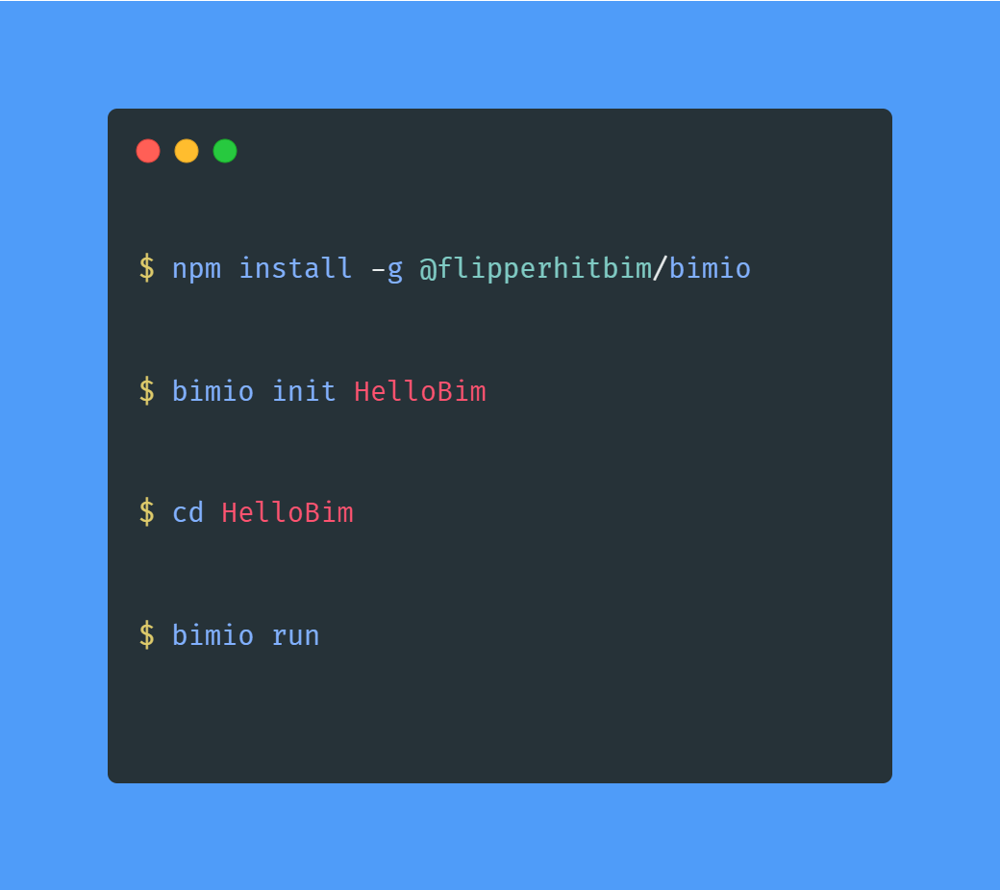

# Hitbim-CLI (bimio)



**Hitbim-CLI (bimio)** is a powerful command line interface designed to streamline the development and distribution of **[Hitbim](https://developer.hitbim.com)** plugins and components.

For more information about terms and usages : **[Hitbim Developer Docs](https://developer.hitbim.com/bim/docs)**

## Table of Contents

- [Overview](#overview)
- [Installation](#installation)
- [Usage](#usage)
- [Getting Started](#getting-started)
- [Command List](#command-list)
  - [init](#init)
  - [create](#create)
  - [run](#run)
  - [stop](#stop)
  - [signup](#signup)
  - [login](#login)
  - [logout](#logout)
  - [session](#session)
  - [mylist](#mylist)
  - [download](#download)
  - [upload](#upload)
  - [help](#help)
- [Support](#support)

## Overview

With **Hitbim-CLI (bimio)**, developers can easily initialize projects, generate sample plugins and components, manage local development servers, and interact with the **[Hitbim](https://developer.hitbim.com)** services for registration, login, download, upload and more.

## Installation

Install **Hitbim-CLI (bimio)** globally with npm:

**Mac**
```
sudo npm install -g @flipperhitbim/bimio
```
**Windows**
```
npm install -g @flipperhitbim/bimio
```

## Usage

**Hitbim-CLI (bimio)** can be used with the command 'bimio'. Here's the command format:

```
bimio [command] [options]
```

## Getting Started

For the first time, initialize your project with the **'init'** command:

```
bimio init [projectName]
```

Change your work directory:

```
cd [projectName]
```

Then you can create plugins or components for your project:

```
bimio create --plugin [pluginNames...]
bimio create --component [componentNames...]
```

To run your project locally, use the **'run'** command:

```
bimio run --port [port]
```

## Command List

### init

```
bimio init <projectName>
```

Initialize a new project with the given project name. You must provide a project name.

### create

```
bimio create --plugin <pluginNames...>
bimio create --component <componentNames...>
bimio create --plugin <pluginNames...> --component <componentNames...>
```

Generate a standard structure following **[Hitbim](https://developer.hitbim.com)**'s architecture. This command generates sample plugins or components for your project. You must select either plugin or component. If you want, you can generate both at the same time.

### run

```
bimio run --port <port>
```

Run your project to see the preview. The default port is **'3000'**.

### stop

```
bimio stop
```

Stop your running project.

### signup

```
bimio signup
```

Redirect you to the signup page for **[Hitbim](https://developer.hitbim.com)** Services.

### login

```
bimio login --email <email> --password <password>
```

Login to **[Hitbim](https://developer.hitbim.com)** Services. Email and password are required. If you are already logged in, it will display your current session information.

### logout

```
bimio logout
```

Logout from **[Hitbim](https://developer.hitbim.com)** Services.

### session

```
bimio session
```

Check whether the user is logged in or not, and show the user's information.

### mylist

```
bimio mylist --plugin
bimio mylist --component
bimio mylist --all
```

Show your lists from **[Hitbim](https://developer.hitbim.com)** Services. You must select either plugin, component, or all.

### download

```
bimio download --plugin <pluginId>
bimio download --component <componentId>
```

Download from **[Hitbim](https://developer.hitbim.com)** Services. You must select either plugin or component.

### upload

```
bimio upload --plugin <pluginNames...>
bimio upload --component <componentNames...>
bimio upload --all
bimio upload --new
```

Upload to **[Hitbim](https://developer.hitbim.com)** Services. You must select either plugin, component, or all. If you want to upload as new, use the '--new' option.

### help

```
bimio help [commandName]
```

Display help information for the specified command, or all commands if no command is specified.

## Support

The current version of **Hitbim-CLI (bimio)** is fully supported on Long Term Support versions of Node.js, and requires at least v.10.

The main forum support is the project [issues](https://github.com/HitbimGit/bimio/issues) on [GitHub](https://github.com/HitbimGit/bimio).
