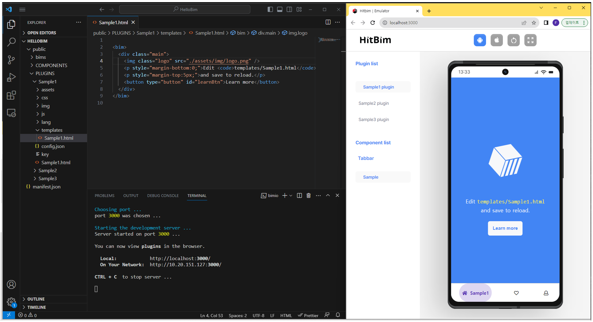

# Hitbim-CLI (bimio)


**Hitbim-CLI (bimio)** is a powerful command line interface designed to streamline the development and distribution of **[Hitbim](https://developer.hitbim.com)** plugins and components.

For more information about terms and usages : **[Hitbim Developer Docs](https://developer.hitbim.com/bim/docs)**

## Table of Contents

- [Overview](#overview)
- [Installation](#installation)
- [Basic Options](#basic-options)
- [Usage](#usage)
- [Getting Started](#getting-started)
- [Real-Time Development](#real-time-development)
- [Project Structure](#project-structure)
- [Command List](#command-list)
  - [init](#init)
  - [create](#create)
  - [run](#run)
  - [stop](#stop)
  - [signup](#signup)
  - [login](#login)
  - [logout](#logout)
  - [session](#session)
  - [mylist](#mylist)
  - [download](#download)
  - [upload](#upload)
  - [docs](#docs)
  - [help](#help)
- [Support](#support)

## Overview

With **Hitbim-CLI (bimio)**, developers can easily initialize projects, generate sample plugins and components, manage local development servers, and interact with the **[Hitbim](https://developer.hitbim.com)** services for registration, login, download, upload and more.

## Installation

Install **Hitbim-CLI (bimio)** globally with npm:

**Mac**

```
sudo npm install -g @flipperhitbim/bimio
```

**Windows**

```
npm install -g @flipperhitbim/bimio
```

## Basic Options

**Hitbim-CLI (bimio)** provides some basic options that can be used with any command:

- `-v, --version` : Display current `bimio` version number.
- `-da, --debug-all` : Enable all debug info output.
- `-ds, --debug-server` : Enable server debug info output.
- `-de, --debug-error` : Enable error debug info output.
- `-h, --help` : Display help for command.

### Example:

```
bimio [command] -ds -de
```

This will execute the given command with server debug info and error debug info output enabled.

## Usage

**Hitbim-CLI (bimio)** can be used with the command 'bimio'. Here's the command format:

```
bimio [command] [options]
```

Always feel free to use `bimio --help` or `bimio -h` to see a list of available commands and options!

## Getting Started

For the first time, initialize your project with the **'init'** command:

```
bimio init [projectName]
```

Change your work directory:

```
cd [projectName]
```

Then you can create plugins or components for your project:

```
bimio create --plugin [pluginNames...]
bimio create --component [componentNames...]
```

To run your project locally, use the **'run'** command:

```
bimio run
```

## Real-Time Development



Using `bimio` alongside an Integrated Development Environment (IDE) like VS Code can drastically improve your development experience. Here's a suggested workflow:

1. **Initialize and Run Your Project**:

   - Start by initializing your project with `bimio init`.
   - Navigate to your project directory and run `bimio run` to start the local development server.

2. **Open in an IDE**:

   - While the server is running, open your project in `VS Code` or your preferred IDE.

3. **Dual-Screen Workflow**:

   - For an optimal experience, consider using a dual-screen setup. On one screen, keep your IDE open with the project files. On the other, have a browser window showing the live server.

4. **Real-Time Feedback Loop**:

   - As you make changes to your plugin or component in the IDE, save the file.
   - Switch to the browser window. Thanks to `bimio`, you'll see the changes reflected instantly by refreshing, restarting of developer server is not needed. This allows for a smooth, real-time feedback loop.

5. **Iterative Development**:
   - Continuously make changes, save, and check the live output. This iterative process helps in rapidly catching and rectifying issues, and viewing updates as they're made.

## Project Structure

When you initialize `bimio` to create project, you're provided with a specific file and directory structure. Here's a breakdown of the generated structure and the responsibilities of each file and directory:

### Directory Structure:

```
ProjectName
├─ manifest.json
└─ public
   ├─ bims
   ├─ COMPONENTS
   │  └─ tabbar
   │     └─ Sample
   │        ├─ assets
   │        ├─ css
   │        │  └─ tabbar.css
   │        ├─ js
   │        │  └─ tabbar.js
   │        └─ tabbar.html
   └─ PLUGINS
      └─ Sample
         ├─ assets
         │  └─ img
         │     └─ logo.png
         ├─ config.json
         ├─ css
         │  └─ Sample.css
         ├─ img
         ├─ js
         │  └─ Sample.js
         ├─ key
         ├─ lang
         │  ├─ en.json
         │  └─ kr.json
         ├─ index.html
         └─ templates
            └─ Sample.html
```

### Key Files and Directories:

Below is a summary of the key files and directories created by `bimio` in the project structure, along with their respective responsibilities:

- **`manifest.json`**: This is the metadata file that contains information about your entire project. It provides a general overview and configurations related to plugins and components.

- **`public` Directory**: This is the main directory where all your public assets, plugins, components, and other related resources reside.

  - **`bims` Directory**: This directory holds assets and configurations related to bims. In the context of Hitbim, `bim` denotes both `Building Information Modeling` and `Built-In Micro-services`, representing the dual concept of constructing an app and incorporating built-in functionalities.

  - **`COMPONENTS` Directory**: The main directory that houses the extra UI components used in your project. Each sub-directory within this directory represents a specific component type.

    - Example: **`tabbar`**
      - **`Sample`**: A sample instance of the `tabbar` component. Each component type can have multiple instances, each tailored for specific purposes or variations.
        - **`assets`**: Holds any static assets related to this specific instance of the component.
        - **`css`**: Contains the CSS files specific to this instance.
          - **`tabbar.css`**: The primary CSS file for the `tabbar` component instance.
        - **`js`**: Contains the JavaScript files that define the behavior of this instance.
          - **`tabbar.js`**: The primary JavaScript file for the component instance.
        - **`tabbar.html`**: The primary HTML file that provides the layout and structure for this `tabbar` component instance.

  - **`PLUGINS` Directory**: This is where all the plugins for your project are stored.
    - Example: **`Sample`**
      - **`assets`**: Holds static assets for the plugin, like images or other files.
      - **`config.json`**: Configuration file for the plugin, defining its properties and behavior.
      - **`css`**: Contains the CSS files specific to the plugin.
      - **`js`**: Contains the JavaScript files defining the behavior of the plugin.
      - **`key`**: File for plugin authentication and credentials.
      - **`lang`**: Contains localization files, with `en.json` for English and `kr.json` for Korean.
      - **`index.html`**: The main HTML interface file for the plugin.
      - **`templates`**: Directory for pages of the plugin.

This structure ensures a systematic approach to developing and managing plugins and components using `bimio`. Remember, while this structure provides a guideline, it's flexible and can be customized based on the specific needs and requirements of your project.

## Command List

### init

```
bimio init <projectName>
```

Initialize a new project with the given project name. You must provide a project name.

### create

```
bimio create --plugin <pluginNames...>
bimio create --component <componentNames...>
bimio create --plugin <pluginNames...> --component <componentNames...>
```

Generate a standard structure following **[Hitbim](https://developer.hitbim.com)**'s architecture. This command generates sample plugins or components for your project. You must select either plugin or component. If you want, you can generate both at the same time.

### run

```
bimio run --port <port>
```

Run your project to see the preview. The default port is **'3000'**.

### stop

```
bimio stop
```

Stop your running project.

### signup

```
bimio signup
```

Redirect you to the signup page for **[Hitbim](https://developer.hitbim.com)** Services.

### login

```
bimio login --email <email> --password <password>
```

Login to **[Hitbim](https://developer.hitbim.com)** Services. Email and password are required. If you are already logged in, it will display your current session information.

### logout

```
bimio logout
```

Logout from **[Hitbim](https://developer.hitbim.com)** Services.

### session

```
bimio session
```

Check whether the user is logged in or not, and show the user's information.

### mylist

```
bimio mylist --plugin
bimio mylist --component
bimio mylist --all
```

Show your lists from **[Hitbim](https://developer.hitbim.com)** Services. You must select either plugin, component, or all.

### download

```
bimio download --plugin <pluginId>
bimio download --component <componentId>
```

Download from **[Hitbim](https://developer.hitbim.com)** Services. You must select either plugin or component.

### upload

```
bimio upload --plugin <pluginNames...>
bimio upload --component <componentNames...>
bimio upload --all
bimio upload --plugin <pluginNames...> --new
bimio upload --component <componentNames...> --new
bimio upload --all --new
```

Upload to **[Hitbim](https://developer.hitbim.com)** Services. You must select either plugin, component, or all. If you want to upload as new, use the '--new' option.

### docs

```
bimio docs
```

Show **[Hitbim Docs](https://developer.hitbim.com/bim/docs)** on your browser.

### help

```
bimio help [commandName]
```

Display help information for the specified command, or all commands if no command is specified.

## Support

The current version of **Hitbim-CLI (bimio)** is fully supported on Long Term Support versions of Node.js, and requires at least v.10.

The main forum support is the project [issues](https://github.com/HitbimGit/bimio/issues) on [GitHub](https://github.com/HitbimGit/bimio).
